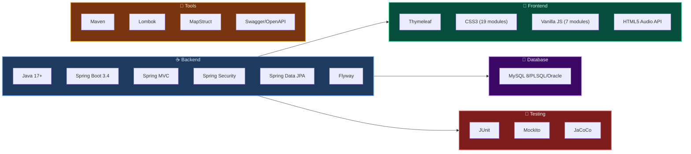

# 🎵 RevPlay — Music Streaming Web Application

<div align="center">

**A full-featured music streaming platform built with Spring Boot & Thymeleaf**

[](https://openjdk.org/)
[](https://spring.io/projects/spring-boot)
[](https://www.mysql.com/)
[](https://www.thymeleaf.org/)
[](#testing)
[](docs/architecture.md)

---

🏠 **Home** · 🔍 **Search** · 📚 **Library** · 📋 **Playlists** · ❤️ **Favorites** · 📜 **History** · 🎤 **Artist Dashboard** · 👑 **Admin Panel**

</div>

---

## 📋 Table of Contents

- [Overview](#-overview)
- [Features](#-features)
- [Tech Stack](#-tech-stack)
- [Architecture](#-architecture)
- [Prerequisites](#-prerequisites)
- [Setup & Installation](#-setup--installation)
- [Running the Application](#-running-the-application)
- [Project Structure](#-project-structure)
- [API Endpoints](#-api-endpoints)
- [Testing](#-testing)
- [Team](#-team)

---

## 🌟 Overview

**RevPlay** is a comprehensive music streaming web application that lets users browse, search, and play music, create playlists, follow artists, and interact with a rich music library. Artists can upload and manage their music, track analytics, and build their audience. Administrators can manage users, approve artist requests, and monitor platform growth.

### Key Highlights

| Feature | Description |
|:--------|:------------|
| 🎵 **Full Music Player** | HTML5 Audio with queue, shuffle, 3-mode repeat, keyboard shortcuts |
| ⚡ **PJAX Navigation** | SPA-like page transitions without full page reloads |
| 🌓 **Light/Dark Themes** | Toggle with localStorage persistence |
| 📱 **Fully Responsive** | 3 breakpoints (1024px, 768px, 480px) with mobile sidebar |
| 🎨 **Modular CSS** | 19 focused CSS files for maintainability |
| 🔒 **Role-Based Access** | LISTENER → ARTIST → ADMIN with upgrade workflow |
| 📊 **Analytics Dashboard** | Play counts, trends, top listeners, fan tracking |
| 🧪 **35 Tests** | 15 unit + 17 integration tests, ≥70% coverage |

---

## ✨ Features

### 🎧 Listener Features
| Feature | Description |
|:--------|:------------|
| 🔍 **Music Browsing** | Browse songs by genre, artist, album with pagination |
| 🎯 **Advanced Search** | Full-text search + multi-filter (genre, artist, album, year) |
| ▶️ **Music Player** | Play/pause, skip, seek, volume control |
| 🔀 **Queue Management** | Add to queue, shuffle, repeat (off/one/all) |
| ⌨️ **Keyboard Shortcuts** | `Space` play/pause, `←→` skip, `M` mute, `S` shuffle, `R` repeat |
| 📋 **Playlists** | Create, edit, delete, add/remove/reorder songs, public/private |
| ❤️ **Favorites** | Heart toggle with optimistic UI & pop animation |
| 📜 **Listening History** | Timeline view, relative timestamps, play all, clear |
| 👥 **Follow Playlists** | Follow/unfollow public playlists from other users |
| 👤 **Profile** | Edit name, bio, upload profile picture with live preview |
| 💿 **Album/Song Detail** | Dedicated detail pages with track lists |
| 🎤 **Artist Profiles** | Browse artists, view profiles with social links |

### 🎤 Artist Features
| Feature | Description |
|:--------|:------------|
| 📝 **Artist Request** | Listeners can apply to become an artist (admin approval) |
| ⬆️ **Song Upload** | Upload audio + metadata (drag-drop, cover image, genre) |
| 💿 **Album Management** | Create/edit/delete albums, manage tracks |
| 🔒 **Visibility Control** | Public / Unlisted / Private per song |
| 📊 **Analytics** | Per-song plays, listening trends, top listeners, fan grid |
| 🖼️ **Profile Settings** | Profile picture, banner, bio, social links |

### 👑 Admin Features
| Feature | Description |
|:--------|:------------|
| 📊 **Dashboard** | 4-tab layout (Overview, Users, Content, Reports) |
| 👥 **User Management** | Search, filter, paginate, change roles, delete |
| ✅ **Artist Requests** | Approve/reject with reason notes |
| 🗑️ **Content Moderation** | Delete any song or playlist |
| 📈 **Growth Analytics** | Role distribution, user growth, top songs |

### 🎨 UI/UX
| Feature | Description |
|:--------|:------------|
| 📱 **Responsive** | Desktop → Tablet → Mobile → Small Mobile |
| 🌓 **Themes** | Light/dark toggle persisted to localStorage |
| ⚡ **PJAX** | SPA-like navigation, no full reloads |
| 📱 **Mobile Sidebar** | Slide-in drawer with hamburger toggle |
| 🔔 **Notifications** | Custom themed confirm dialogs & toast messages |
| 🃏 **SVG Icons** | Clean vector icons throughout (no emojis) |
| 💎 **Glassmorphism** | Modern UI with backdrop blur modals |

---

## 🛠️ Tech Stack



| Layer | Technology | Version |
|:------|:-----------|:--------|
| **Language** | Java | 17+ |
| **Framework** | Spring Boot | 3.4.x |
| **Web** | Spring MVC | — |
| **Security** | Spring Security + BCrypt | — |
| **ORM** | Spring Data JPA / Hibernate | — |
| **Database** | MySQL / Oracle / PLSQL | 8.0+ |
| **Migrations** | Flyway | Community |
| **Templating** | Thymeleaf | 3.x |
| **Frontend** | Vanilla JS + HTML5 + CSS3 | — |
| **Testing** | JUnit + Mockito + JaCoCo | — |
| **API Docs** | Springdoc OpenAPI (Swagger) | 2.8.5 |
| **Build** | Maven | 3.9+ |
| **Utilities** | Lombok, MapStruct | — |

---

## 🏗️ Architecture

> 📐 **Complete diagrams & ERD:** [`docs/architecture.md`](docs/architecture.md)

### High-Level Overview

```
┌──────────────────────────────────────────────────────────────────┐
│                        🖥️ Client Browser                        │
│   21 Thymeleaf Pages  ·  7 Fragments  ·  19 CSS  ·  7 JS       │
│   HTML5 Audio Player  ·  PJAX Navigation  ·  Light/Dark Theme   │
├──────────────────────────────────────────────────────────────────┤
│                    🔒 Spring Security Layer                      │
│      BCrypt · Session Auth · Role-Based URL Protection           │
├──────────────────────────────────────────────────────────────────┤
│                   🌐 Controller Layer (17)                       │
│         5 MVC Controllers  ·  12 REST API Controllers            │
├──────────────────────────────────────────────────────────────────┤
│                    ⚙️ Service Layer (17)                         │
│      Business Logic  ·  File Storage  ·  Analytics Engine        │
├──────────────────────────────────────────────────────────────────┤
│                   📦 Data Access Layer                           │
│     12 JPA Repositories  ·  SongSpecification  ·  SongMapper    │
├──────────────────────────────────────────────────────────────────┤
│           💾 MySQL / Oracle / PLSQL (12 tables, Flyway)         │
│               📁 Local Filesystem (/uploads/)                    │
└──────────────────────────────────────────────────────────────────┘
```

---

## 📋 Prerequisites

| Software | Version | Required |
|:---------|:--------|:---------|
| ☕ Java JDK | 17+ | ✅ |
| 📦 Maven | 3.9+ | ✅ |
| 🐬 Database | MySQL / Oracle | ✅ |
| 🔀 Git | Latest | ✅ |
| 💻 IDE | IntelliJ IDEA (recommended) | Optional |

---

## 🚀 Setup & Installation

### 1️⃣ Clone the Repository
```bash
git clone https://github.com/your-username/revplay.git
cd revplay/Revplay_P2
```

### 2️⃣ Create MySQL Database
```sql
CREATE DATABASE revplay_db;
```
> 💡 Flyway will automatically create all 12 tables on first startup.

### 3️⃣ Configure Database Credentials
Edit `src/main/resources/application.yml`:
```yaml
spring:
  datasource:
    url: jdbc:mysql://localhost:3306/revplay_db?createDatabaseIfNotExist=true
    username: root
    password: your_password    # ← Change this
```

### 4️⃣ Build the Project
```bash
# On macOS/Linux:
./mvnw clean install -DskipTests

# On Windows:
mvnw.cmd clean install -DskipTests
```

---

## ▶️ Running the Application

### Start the Server
```bash
./mvnw spring-boot:run
```

🌐 **Open:** [http://localhost:8080](http://localhost:8080)

### Default Seed Data Accounts

| Role | Email | Password |
|:-----|:------|:---------|
| 👑 Admin | `admin@revplay.com` | `admin123` |
| 🎤 Artist | `artist@revplay.com` | `artist123` |
| 🎧 Listener | `user@revplay.com` | `user123` |

> 📝 See `V99__seed_data.sql` for complete seed data (songs, albums, artists, playlists, etc.)

### Application Routes

| Route | Access | Description |
|:------|:-------|:------------|
| `/` | 🌍 Public | Home — trending songs, playlists, artists |
| `/login` | 🌍 Public | Login page |
| `/register` | 🌍 Public | Registration page |
| `/library` | 🌍 Public | Song library with search & filters |
| `/search` | 🌍 Public | Search results |
| `/player` | 🌍 Public | Full-screen player |
| `/artist/{id}` | 🌍 Public | Artist public profile |
| `/artists` | 🌍 Public | Browse all artists |
| `/albums` | 🌍 Public | Browse all albums |
| `/albums/{id}` | 🌍 Public | Album detail with tracks |
| `/songs/{id}` | 🌍 Public | Song detail page |
| `/about` | 🌍 Public | About RevPlay |
| `/playlists` | 🔐 Auth | Playlist management |
| `/favorites` | 🔐 Auth | Favorites page |
| `/history` | 🔐 Auth | Listening history |
| `/profile` | 🔐 Auth | User profile & settings |
| `/artist/dashboard` | 🎤 Artist | Artist dashboard & analytics |
| `/artist/songs` | 🎤 Artist | Song management (upload, edit, delete) |
| `/artist/albums` | 🎤 Artist | Album management |
| `/admin/dashboard` | 👑 Admin | Admin dashboard |
| `/swagger-ui.html` | 🌍 Public | API documentation |

---

## 📂 Project Structure

```
Revplay_P2/
├── 📂 src/main/java/com/revplay/
│   ├── ⚙️ config/              (3)   SecurityConfig, WebConfig, GlobalModelAdvice
│   ├── 🌐 controller/          (17)  5 MVC + 12 REST controllers
│   ├── ⚙️ service/             (17)  Business logic + file storage
│   ├── 📚 repository/          (12)  Spring Data JPA
│   ├── 📦 model/               (14)  12 entities + 2 enums
│   ├── 📬 dto/                 (17)  Request/response DTOs
│   ├── ⚠️ exception/           (8)   Custom exceptions + handlers
│   ├── 🔄 mapper/              (1)   SongMapper
│   ├── 🔍 specification/       (1)   SongSpecification
│   └── 🔧 util/                (1)   SecurityUtils
│
├── 📂 src/main/resources/
│   ├── 📄 application.yml
│   ├── 📄 logback-spring.xml
│   ├── 🗃️ db/migration/        (5)   Flyway SQL migrations
│   ├── 📄 templates/           (21)  Thymeleaf pages
│   │   └── 🧩 fragments/       (7)   Reusable components
│   └── 🎨 static/
│       ├── css/                (19)  7 foundation + 12 page-specific
│       ├── js/                 (7)   Player, nav, favorites, etc.
│       └── images/                   Icons & team photos
│
├── 📂 src/test/java/com/revplay/
│   ├── 🔬 service/             (15)  Unit tests (JUnit + Mockito)
│   ├── 🧩 controller/          (17)  Integration tests (@SpringBootTest)
│   └── 🛠️ util/                (3)   Test utilities
│
├── 📂 docs/
│   ├── 📐 architecture.md             ERD + architecture diagrams
│   └── 📋 RevPlay_Team_Plan.md        Team roles & plan
│
├── 📄 pom.xml
├── 📄 README.md
└── 📁 uploads/                        Runtime file storage (gitignored)
```

### File Count Summary

| Category | Count |
|:---------|------:|
| Java Models | 14 |
| Controllers | 17 |
| Services | 17 |
| DTOs | 17 |
| Repositories | 12 |
| Templates | 21 |
| Fragments | 7 |
| CSS Files | 19 |
| JS Files | 7 |
| Tests | 35 |
| Config | 3 |
| Exceptions | 8 |
| Migrations | 5 |
| Other | 3 |
| **Total** | **~155** |

---

## 📡 API Endpoints

### Swagger UI
With the server running: **[http://localhost:8080/swagger-ui.html](http://localhost:8080/swagger-ui.html)**

### Endpoint Groups

| Prefix | Controller | # | Auth | Description |
|:-------|:-----------|:-:|:-----|:------------|
| `/api/auth` | AuthController | 2 | 🌍 | Register, Login |
| `/user` | UserController | 5 | 🔐 | Profile, picture, artist-request |
| `/api/songs` | SongController | 4 | 🌍 | Browse, search, filter, stream |
| `/api/albums` | AlbumController | 2 | 🌍 | Browse, detail |
| `/api/artists` | ArtistCatalogController | 2 | 🌍 | Artist profiles, list |
| `/api/genres` | GenreController | 1 | 🌍 | Genre list |
| `/api/playlists` | PlaylistController | 8 | 🔐 | CRUD + song management |
| `/api/playlists/.../follow` | PlaylistFollowController | 3 | 🔐 | Follow/unfollow |
| `/api/favorites` | FavoriteController | 4 | 🔐 | Toggle, list, IDs |
| `/api/history` | HistoryController | 4 | 🔐 | Record, list, clear |
| `/api/artists/me` | ArtistManagementController | 5 | 🎤 | Profile management |
| `/api/artists/songs` | ArtistSongController | 4 | 🎤 | Upload, edit, delete |
| `/api/artists/albums` | ArtistAlbumController | 7 | 🎤 | Album CRUD |
| `/api/artists/analytics` | AnalyticsController | 5 | 🎤 | Stats, trends, fans |
| `/api/admin` | AdminController | 9+ | 👑 | Users, content, requests |

---

## 🧪 Testing

### Run All Tests
```bash
./mvnw test
```

### Generate Coverage Report
```bash
./mvnw test jacoco:report
# Report at: target/site/jacoco/index.html
```

### Test Coverage

| Type | Count | Framework |
|:-----|------:|:----------|
| 🔬 Unit Tests | 15 | JUnit + Mockito |
| 🧩 Integration Tests | 17 | @SpringBootTest |
| 🛠️ Test Utilities | 3 | Shared helpers |
| **Total** | **35** | **Coverage Target: ≥ 70%** |

<details>
<summary>📋 Click to see all test classes</summary>

**Unit Tests (15):**
`AuthServiceTest` · `UserServiceTest` · `AdminServiceTest` · `CustomUserDetailsServiceTest` · `SongServiceTest` · `ArtistCatalogServiceTest` · `AlbumCatalogServiceTest` · `AlbumServiceImplTest` · `ArtistServiceImplTest` · `PlaylistServiceTest` · `PlaylistFollowServiceTest` · `FavoriteServiceTest` · `HistoryServiceTest` · `FileStorageServiceTest` · `AnalyticsServiceTest`

**Integration Tests (17):**
`AuthControllerIT` · `UserControllerIT` · `AdminControllerIT` · `PageControllerIT` · `LibraryControllerIT` · `SongControllerIT` · `AlbumControllerIT` · `ArtistCatalogControllerIT` · `ArtistManagementControllerIT` · `ArtistSongControllerIT` · `ArtistAlbumControllerIT` · `GenreControllerIT` · `PlaylistControllerIT` · `PlaylistFollowControllerIT` · `FavoriteControllerIT` · `HistoryControllerIT` · `AnalyticsControllerIT`

**Utilities (3):**
`IntegrationTestBase` · `TestDataBuilder` · `TestConstants`

</details>

---

## 👥 Team

| # | Member | Role | Key Areas |
|:-:|:-------|:-----|:----------|
| 1 | **Tech Lead** | Frontend / Auth / Admin | Full frontend (21 pages, 19 CSS, 7 JS), authentication, admin dashboard, code review |
| 3 | **Backend** | Music Catalog & Search | Songs, albums, artists CRUD, search/filter APIs, JPA Specifications |
| 4 | **Backend** | Playlists & Social | Playlist CRUD, favorites, listening history, follow/unfollow |
| 5 | **Backend** | Artist & Analytics | Artist profiles, music upload, album management, analytics APIs |
| 6 | **DevOps** | Database & Testing | ERD, Flyway migrations, JUnit/Mockito test suites, JaCoCo coverage |

---

## 📄 License

This project was built as part of an academic sprint project (10-day sprint, Feb 26 – Mar 8, 2026).

---

<div align="center">

**🎵 Built with ❤️ by the RevPlay Team 🎵**

[⬆ Back to Top](#-revplay--music-streaming-web-application)

</div>
