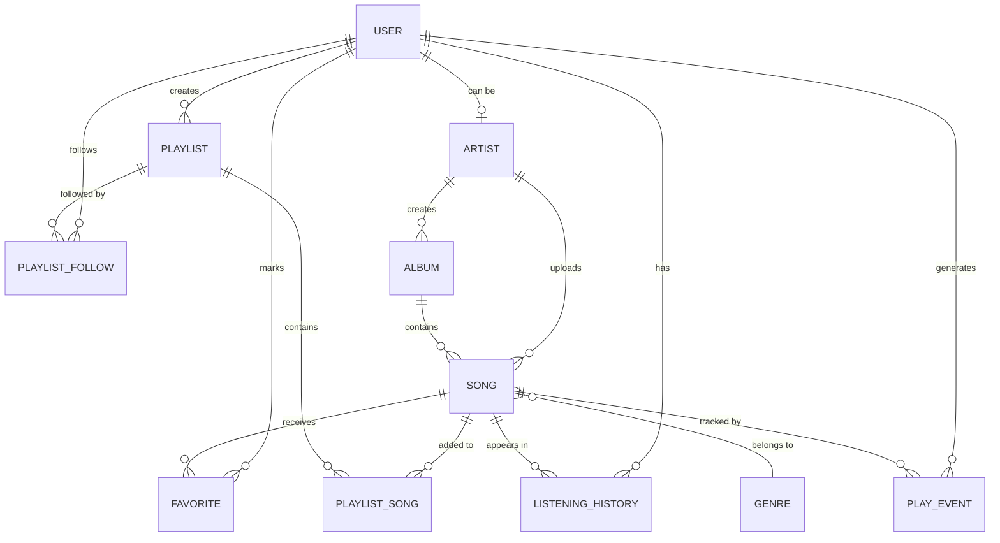

# RevPlay P2 — Team Roles, Responsibilities & Project Plan

> **Stack**: Java + Spring Boot + Thymeleaf + Spring Security + MySQL — Single monolithic project
> **Team Size**: 5 members

## Team Overview

| # | Role | Key Responsibility Areas |
|---|------|------------------------|
| **You (Member 1)** | **Tech Lead / Frontend / Auth & User Mgmt / PR Reviewer** | Full frontend (Thymeleaf), auth & user management backend, Spring Security, code review for all PRs, integration testing |
| **Member 3** | **Backend — Music Catalog & Search** | Songs, albums, artists CRUD, search/filter APIs, genre/category browsing |
| **Member 4** | **Backend — Playlists, Favorites & History** | Playlist CRUD, favorites, listening history, follow/unfollow playlists |
| **Member 5** | **Backend — Artist Features & Analytics** | Artist profiles, music upload, album management, analytics dashboard APIs |
| **Member 6** | **Database Design, Testing & DevOps** | ERD, schema migrations, Flyway, JUnit/Mockito test suites, CI pipeline, SLF4J logging |

---

## Detailed Role Breakdown

### 🎯 You (Member 1) — Tech Lead / Frontend / Auth & User Mgmt / PR Reviewer

**Frontend (Full Ownership — Thymeleaf + HTML/CSS/JS)**
- All Thymeleaf templates (`.html` files with `th:` attributes)
- Thymeleaf fragments for reusable components (navbar, footer, player bar, song cards)
- Responsive design (mobile + desktop) using CSS
- Integrated music player UI (play, pause, skip, seek, volume, shuffle, repeat, queue) — JavaScript + HTML5 Audio API
- Song library, search results, artist profiles, album views, playlist pages
- User profile & settings pages, artist dashboard UI
- Login / Register pages
- Real-time progress bar & now-playing display
- AJAX calls (Fetch/jQuery) for dynamic interactions without full page reload (favorites toggle, queue management)

**Authentication & User Management (Backend)**
- `POST /api/auth/register` — user registration (email, username, password)
- `POST /api/auth/login` — login with email/username + password
- `GET/PUT /api/users/profile` — view & edit profile (display name, bio, profile picture)
- `GET /api/users/stats` — account statistics (playlists count, favorites count, listening time)
- Role-based access control (`ROLE_USER`, `ROLE_ARTIST`, `ROLE_ADMIN`)
- Password hashing with **BCrypt**
- Session management (Spring Security + HttpSession)
- `SecurityConfig` — Spring Security filter chain, login/logout config, role-based URL protection

**Entities & Tables (Auth)**
- `User` (id, email, username, password_hash, display_name, bio, profile_picture_url, role, created_at, updated_at)

**Key Classes (Auth)**
- `UserController`, `AuthController`
- `UserService`, `AuthService`
- `UserRepository`
- `SecurityConfig`
- `UserDTO`, `LoginRequest`, `RegisterRequest`

**Tech Lead**
- PR review and approval for all 4 members
- Architecture decisions and conflict resolution
- Final integration testing before submission
- README.md, architecture diagram

**Testing (Auth)**
- JUnit + Mockito unit tests for `AuthService`, `UserService`
- Integration tests for auth endpoints

---

### 🎵 Member 3 — Music Catalog & Search

**Features Owned**
- `GET /api/songs` — browse all songs (paginated)
- `GET /api/songs/{id}` — song details
- `GET /api/songs/search?q=` — search by keyword
- `GET /api/songs/filter?genre=&artist=&album=&year=` — filter songs
- `GET /api/artists` — list all artists
- `GET /api/artists/{id}` — artist profile with songs & albums
- `GET /api/albums` — list all albums
- `GET /api/albums/{id}` — album details with track list
- `GET /api/genres` — list genres / categories

**Entities & Tables**
- `Song` (id, title, genre, duration, audio_url, cover_image_url, release_date, play_count, visibility, artist_id, album_id, created_at)
- `Album` (id, name, description, cover_image_url, release_date, artist_id, created_at)
- `Artist` (id, user_id, artist_name, bio, genre, profile_picture_url, banner_image_url, instagram, twitter, youtube, spotify, website, created_at)
- `Genre` (id, name)

**Key Classes**
- `SongController`, `ArtistController`, `AlbumController`
- `SongService`, `ArtistService`, `AlbumService`
- `SongRepository`, `ArtistRepository`, `AlbumRepository`
- `SongDTO`, `ArtistDTO`, `AlbumDTO`
- `SongSpecification` (for dynamic filtering with Spring Data JPA Specifications)

**Testing**
- Unit tests for all service classes
- Integration tests for search & filter endpoints

---

### 📋 Member 4 — Playlists, Favorites & Listening History

**Features Owned**

*Playlists*
- `POST /api/playlists` — create playlist (name, description, privacy)
- `GET /api/playlists/me` — my playlists
- `GET /api/playlists/{id}` — playlist details + songs
- `PUT /api/playlists/{id}` — update name/description/privacy
- `DELETE /api/playlists/{id}` — delete my playlist
- `POST /api/playlists/{id}/songs/{songId}` — add song
- `DELETE /api/playlists/{id}/songs/{songId}` — remove song
- `PUT /api/playlists/{id}/reorder` — reorder songs
- `GET /api/playlists/public` — browse public playlists
- `POST /api/playlists/{id}/follow` — follow playlist
- `DELETE /api/playlists/{id}/follow` — unfollow playlist

*Favorites*
- `POST /api/favorites/{songId}` — mark as favorite
- `DELETE /api/favorites/{songId}` — remove from favorites
- `GET /api/favorites` — all my favorites

*Listening History*
- `POST /api/history` — record a play event
- `GET /api/history?limit=50` — recent history
- `GET /api/history/all` — complete history with timestamps
- `DELETE /api/history` — clear history

**Entities & Tables**
- `Playlist` (id, name, description, is_public, user_id, created_at, updated_at)
- `PlaylistSong` (id, playlist_id, song_id, position, added_at)
- `Favorite` (id, user_id, song_id, created_at)
- `ListeningHistory` (id, user_id, song_id, played_at)
- `PlaylistFollow` (id, user_id, playlist_id, followed_at)

**Key Classes**
- `PlaylistController`, `FavoriteController`, `HistoryController`
- `PlaylistService`, `FavoriteService`, `HistoryService`
- `PlaylistRepository`, `FavoriteRepository`, `HistoryRepository`
- `PlaylistDTO`, `FavoriteDTO`, `HistoryDTO`

**Testing**
- Unit tests for all service classes
- Integration tests for playlist CRUD, favorite toggle, history

---

### 🎤 Member 5 — Artist Features & Analytics

**Features Owned**

*Artist Profile Management*
- `POST /api/artists/register` — register as artist
- `GET/PUT /api/artists/me` — manage own artist profile
- `PUT /api/artists/me/social-links` — add/update social media links

*Music Upload & Management*
- `POST /api/artists/songs` — upload song (title, genre, duration, audio file)
- `PUT /api/artists/songs/{id}` — update song info
- `DELETE /api/artists/songs/{id}` — delete song
- `PUT /api/artists/songs/{id}/visibility` — set public/unlisted
- `POST /api/artists/albums` — create album
- `PUT /api/artists/albums/{id}` — update album
- `DELETE /api/artists/albums/{id}` — delete album (only if empty)
- `POST /api/artists/albums/{id}/songs/{songId}` — add song to album
- `DELETE /api/artists/albums/{id}/songs/{songId}` — remove song from album
- `GET /api/artists/me/songs` — my uploaded songs
- `GET /api/artists/me/albums` — my albums

*Analytics APIs*
- `GET /api/artists/analytics/overview` — total songs, total plays, total favorites
- `GET /api/artists/analytics/songs` — per-song play counts, sorted by popularity
- `GET /api/artists/analytics/songs/{id}/fans` — users who favorited a song
- `GET /api/artists/analytics/trends?period=daily|weekly|monthly` — listening trends
- `GET /api/artists/analytics/top-listeners` — top listeners for the artist

**Entities & Tables**
- Reuses `Song`, `Album`, `Artist` entities from Member 3
- `PlayEvent` (id, song_id, user_id, played_at) — granular event for analytics

> [!IMPORTANT]
> Member 5 must coordinate closely with **Member 3** since they share the `Song`, `Album`, and `Artist` entities. Member 3 handles the read/browse side; Member 5 handles the write/upload/analytics side.

**Key Classes**
- `ArtistManagementController`, `AnalyticsController`
- `ArtistManagementService`, `AnalyticsService`, `FileStorageService`
- `PlayEventRepository`
- `AnalyticsDTO`, `SongStatsDTO`, `TrendDTO`

**Testing**
- Unit tests for analytics calculations, file upload logic
- Integration tests for upload + analytics endpoints

---

### 🗄️ Member 6 — Database, Testing & DevOps

**Features Owned**

*Database*
- Complete ERD design (draw.io / dbdiagram.io)
- SQL schema creation scripts
- **Flyway** migration files (`V1__initial_schema.sql`, etc.)
- Sample/seed data for demo (`V99__seed_data.sql`)
- Database indexing strategy (indexes on search columns, foreign keys)

*Testing Infrastructure*
- Project-wide **JUnit 4** test configuration
- **Mockito** mocking setup and patterns
- Shared test utilities & fixtures (`TestDataBuilder`, `TestConstants`)
- Integration test base classes using `@SpringBootTest`
- Code coverage targets and reports (JaCoCo)
- Review and validate test coverage for all members

*Logging & DevOps*
- **SLF4J + Logback** configuration (`logback-spring.xml`)
- Logging standards: INFO for controllers, DEBUG for services, ERROR for exceptions
- Global exception handler (`@ControllerAdvice`) with proper error responses
- `application.properties` / `application.yml` profiles (dev, test, prod)
- Maven `pom.xml` dependency management
- `.gitignore`, branch strategy documentation

**Key Classes / Files**
- `GlobalExceptionHandler`, `ErrorResponse`
- `logback-spring.xml`
- `application.yml` (with profiles)
- `db/migration/V1__*.sql` (Flyway migrations)
- `TestBase`, `TestDataBuilder`

---

## Technology Stack

| Layer | Technology | Notes |
|-------|-----------|-------|
| Language | **Java 17+** | |
| Framework | **Spring Boot 3.x** | Spring Web, Spring Data JPA, Spring Security |
| Build Tool | **Maven** | |
| Database | **MySQL 8** or **PostgreSQL 15** | |
| ORM | **Hibernate** (via Spring Data JPA) | |
| Migrations | **Flyway** | Free, auto-runs on startup |
| Security | **Spring Security + BCrypt** | Session-based auth |
| Templating | **Thymeleaf** | Server-side rendered frontend |
| Logging | **SLF4J + Logback** | ✅ Free, ships with Spring Boot |
| Unit Testing | **JUnit 4** + **Mockito** | ✅ Free, included via `spring-boot-starter-test` |
| Coverage | **JaCoCo** | ✅ Free Maven plugin |
| API Docs | **Springdoc OpenAPI (Swagger)** | ✅ Free, auto-generates API docs |
| File Storage | **Local filesystem** or **MinIO** | For audio files & images |
| Version Control | **Git + GitHub/GitLab** | Feature branches + PRs |

---

## Project Structure (Proposed)

```
revplay/
├── src/main/java/com/revplay/
│   ├── RevPlayApplication.java
│   ├── config/
│   │   ├── SecurityConfig.java          ← You
│   │   └── WebConfig.java
│   ├── controller/
│   │   ├── AuthController.java          ← You
│   │   ├── UserController.java          ← You
│   │   ├── SongController.java          ← Member 3
│   │   ├── ArtistController.java        ← Member 3
│   │   ├── AlbumController.java         ← Member 3
│   │   ├── PlaylistController.java      ← Member 4
│   │   ├── FavoriteController.java      ← Member 4
│   │   ├── HistoryController.java       ← Member 4
│   │   ├── ArtistMgmtController.java    ← Member 5
│   │   └── AnalyticsController.java     ← Member 5
│   ├── service/
│   │   └── ...                          (mirrors controllers)
│   ├── repository/
│   │   └── ...
│   ├── model/
│   │   ├── User.java                    ← You
│   │   ├── Song.java
│   │   ├── Album.java
│   │   ├── Artist.java
│   │   ├── Playlist.java
│   │   ├── PlaylistSong.java
│   │   ├── Favorite.java
│   │   ├── ListeningHistory.java
│   │   ├── PlaylistFollow.java
│   │   ├── PlayEvent.java
│   │   └── Genre.java
│   ├── dto/
│   │   └── ...
│   ├── exception/
│   │   ├── GlobalExceptionHandler.java  ← Member 6
│   │   └── ErrorResponse.java           ← Member 6
│   └── util/
├── src/main/resources/
│   ├── application.yml                  ← Member 6
│   ├── logback-spring.xml               ← Member 6
│   ├── db/migration/                    ← Member 6
│   │   ├── V1__initial_schema.sql
│   │   └── V99__seed_data.sql
│   ├── templates/                       ← You (Thymeleaf)
│   │   ├── index.html
│   │   ├── login.html
│   │   ├── register.html
│   │   ├── library.html
│   │   ├── player.html
│   │   ├── playlist.html
│   │   ├── artist-profile.html
│   │   ├── artist-dashboard.html
│   │   └── fragments/
│   │       ├── navbar.html
│   │       ├── footer.html
│   │       ├── player-bar.html
│   │       └── song-card.html
│   └── static/
│       ├── css/
│       │   └── styles.css
│       ├── js/
│       │   ├── player.js
│       │   └── app.js
│       └── images/
├── src/test/java/com/revplay/          ← All members + Member 6 oversight
├── pom.xml                              ← Member 6
├── README.md                            ← You
└── docs/
    ├── ERD.png                          ← Member 6
    └── architecture-diagram.png         ← You
```

---

## Entity Relationship Diagram (Outline)



---

## Sprint Plan (3-Week Timeline)

### Week 1 — Foundation & Core APIs

| Day | You | Member 3 | Member 4 | Member 5 | Member 6 |
|-----|-----|----------|----------|----------|----------|
| 1-2 | Spring Security config, register/login endpoints, `User` entity, base Thymeleaf layout, navbar/footer fragments | Song, Album, Artist entities & repos | Playlist, Favorite, History entities & repos | Artist management entities | ERD, Flyway migrations, pom.xml, logging setup |
| 3-4 | Login/Register pages, auth tests, library page, CSS design system | Browse songs & search APIs + tests | Playlist CRUD APIs | Artist register + profile APIs | Seed data, test utilities, exception handler |
| 5 | **PR Review Day** | Assist with bug fixes | Assist with bug fixes | Assist with bug fixes | Assist with bug fixes |

### Week 2 — Feature Build-Out

| Day | You | Member 3 | Member 4 | Member 5 | Member 6 |
|-----|-----|----------|----------|----------|----------|
| 1-2 | User profile edit + stats endpoints, music player bar (HTML5 Audio + JS) | Filter APIs, artist profile, album view | Favorites, history, follow/unfollow | Song upload, album management | Integration tests, coverage report |
| 3-4 | Profile picture upload, playlist page, favorites page, artist dashboard page, search page | Search refinement | Reorder songs, clear history | Analytics APIs (overview, trends) | Logging audit, test review |
| 5 | **PR Review Day** | Bug fixes | Bug fixes | Bug fixes | Bug fixes |

### Week 3 — Polish & Delivery

| Day | You | Member 3 | Member 4 | Member 5 | Member 6 |
|-----|-----|----------|----------|----------|----------|
| 1-2 | Security hardening, responsive design, queue UI, shuffle/repeat via JS, AJAX favorites toggle | Pagination, sorting, edge cases | Public playlists browse, edge cases | Visibility toggle, song deletion, top listeners | Final test suite, coverage ≥ 70% |
| 3 | Full integration testing, bug fixes | Support | Support | Support | Support |
| 4 | README.md, architecture diagram | Final tests | Final tests | Final tests | ERD finalization |
| 5 | **Final demo prep & submission** | Demo support | Demo support | Demo support | Demo support |

---

## Git Branching Strategy

```
main
├── develop
│   ├── feature/auth-frontend      ← You (auth + frontend combined)
│   ├── feature/music-catalog      ← Member 3
│   ├── feature/playlists          ← Member 4
│   ├── feature/artist-analytics   ← Member 5
│   └── feature/db-testing         ← Member 6
```

**Rules:**
1. All feature branches created from `develop`
2. Submit PR to `develop` → **You** review and merge
3. `develop` merged to `main` only at sprint milestones
4. Commit messages: `feat:`, `fix:`, `test:`, `docs:`, `refactor:`

---

## Coding Standards

- **Logging**: Use `private static final Logger log = LoggerFactory.getLogger(ClassName.class);` — no `System.out.println()`
- **DTOs**: Never expose entities directly in API responses; always use DTOs
- **Exceptions**: Throw custom exceptions (`ResourceNotFoundException`, `UnauthorizedException`); handled by `GlobalExceptionHandler`
- **Tests**: Every service class must have a corresponding test class with ≥ 3 test methods
- **Naming**: REST endpoints follow `/api/{resource}` pattern, camelCase for Java, snake_case for DB columns

---

## Additional Free Technologies Recommended

| Technology | Purpose | Cost |
|-----------|---------|------|
| **SLF4J + Logback** | Structured logging (ships with Spring Boot) | ✅ Free |
| **Mockito** | Mocking in unit tests (ships with `spring-boot-starter-test`) | ✅ Free |
| **JaCoCo** | Code coverage reports | ✅ Free |
| **Flyway** | Database migration versioning | ✅ Free (Community) |
| **Springdoc OpenAPI** | Auto-generated Swagger API docs | ✅ Free |
| **Lombok** | Reduce boilerplate (getters/setters/constructors) | ✅ Free |
| **MapStruct** | Entity ↔ DTO mapping | ✅ Free |
| **H2 Database** | In-memory DB for tests | ✅ Free |

> [!TIP]
> All of these are open-source and already included or easily added via Maven. `SLF4J` and `Mockito` are bundled with Spring Boot — zero extra setup needed.

---

## Coordination Points

> [!IMPORTANT]
> **Member 3 ↔ Member 5** share `Song`, `Album`, `Artist` entities. Member 3 owns the entity classes; Member 5 reuses them. Any schema change must be discussed between both and approved by Member 6 (DB owner).

> [!IMPORTANT]
> **You ↔ Everyone** — the `User` entity and `SecurityConfig` are owned by you and used by all modules. Provide early stubs so other members can test their features with authentication.

> [!NOTE]
> **Member 4 ↔ Member 3** — Playlist songs reference the `Song` entity. Member 4 depends on Member 3's song APIs being available for testing.
