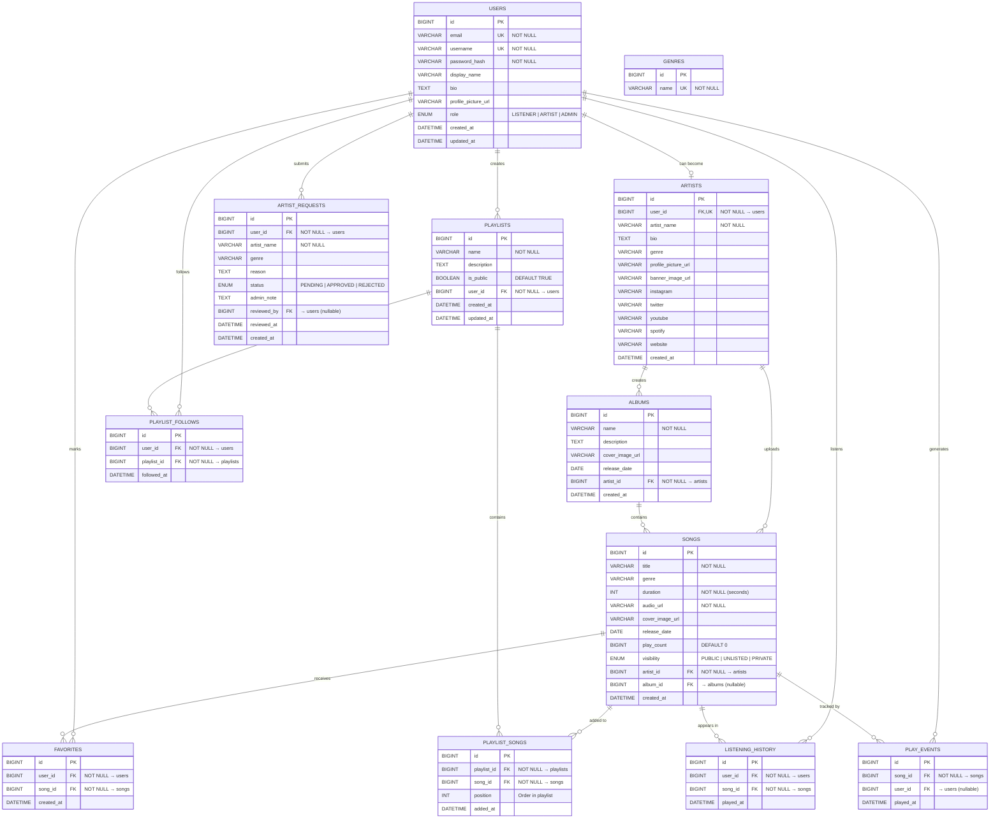
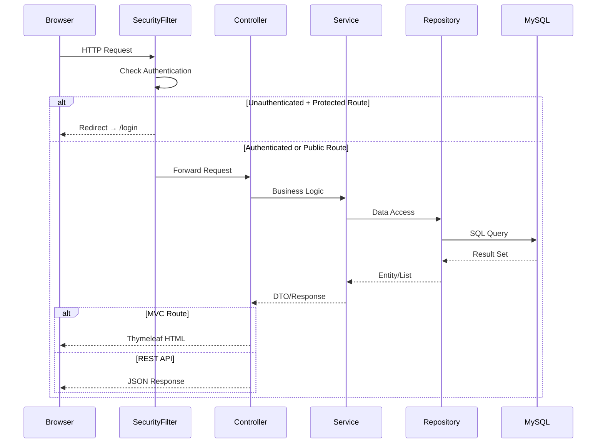
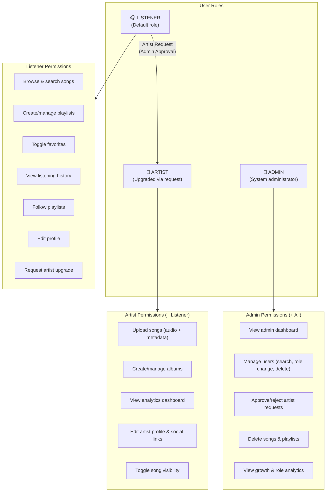

# RevPlay — Architecture & ERD Documentation

---

## 1. Entity Relationship Diagram (ERD)

### Database Indexes

| Table | Index | Columns | Purpose |
|-------|-------|---------|---------|
| `users` | `idx_users_email` | `email` | Login lookup |
| `users` | `idx_users_username` | `username` | Login lookup |
| `users` | `idx_users_role` | `role` | Admin filtering |
| `artists` | `idx_artists_artist_name` | `artist_name` | Search |
| `albums` | `idx_albums_artist_id` | `artist_id` | FK lookup |
| `albums` | `idx_albums_release_date` | `release_date` | Sorting |
| `songs` | `idx_songs_artist_id` | `artist_id` | FK lookup |
| `songs` | `idx_songs_album_id` | `album_id` | FK lookup |
| `songs` | `idx_songs_title` | `title` | Search |
| `songs` | `idx_songs_genre` | `genre` | Filter |
| `songs` | `idx_songs_visibility` | `visibility` | Filter |
| `songs` | `idx_songs_play_count` | `play_count DESC` | Trending sort |
| `songs` | `idx_songs_release_date` | `release_date` | Sorting |
| `playlists` | `idx_playlists_user_id` | `user_id` | FK lookup |
| `playlists` | `idx_playlists_is_public` | `is_public` | Public browse |
| `playlist_songs` | `idx_ps_playlist_id` | `playlist_id` | FK lookup |
| `playlist_songs` | `idx_ps_song_id` | `song_id` | FK lookup |
| `favorites` | `idx_fav_user_id` | `user_id` | FK lookup |
| `favorites` | `idx_fav_song_id` | `song_id` | FK lookup |
| `listening_history` | `idx_lh_user_id` | `user_id` | FK lookup |
| `listening_history` | `idx_lh_song_id` | `song_id` | FK lookup |
| `listening_history` | `idx_lh_played_at` | `played_at DESC` | Recent history |
| `playlist_follows` | `idx_pf_user_id` | `user_id` | FK lookup |
| `playlist_follows` | `idx_pf_playlist_id` | `playlist_id` | FK lookup |
| `play_events` | `idx_pe_song_id` | `song_id` | Analytics queries |
| `play_events` | `idx_pe_user_id` | `user_id` | Analytics queries |
| `play_events` | `idx_pe_played_at` | `played_at DESC` | Trend analysis |

### Unique Constraints

| Table | Constraint | Columns |
|-------|-----------|---------|
| `users` | `uq_users_email` | `email` |
| `users` | `uq_users_username` | `username` |
| `genres` | `uq_genres_name` | `name` |
| `artists` | `uq_artists_user_id` | `user_id` |
| `playlist_songs` | `uq_playlist_songs` | `(playlist_id, song_id)` |
| `favorites` | `uq_favorites` | `(user_id, song_id)` |
| `playlist_follows` | `uq_playlist_follows` | `(user_id, playlist_id)` |

---

## 2. Application Architecture Diagram

```mermaid
graph TB
    subgraph CLIENT["🖥️ Client Browser"]
        HTML["Thymeleaf HTML Pages<br/>(17 pages + 7 fragments)"]
        CSS["Modular CSS<br/>(17 files)"]
        JS["JavaScript Modules<br/>(7 files)"]
        AUDIO["HTML5 Audio API"]
    end

    subgraph SPRING_BOOT["☕ Spring Boot 3.x Application"]
        subgraph SECURITY["🔒 Security Layer"]
            SEC_CONFIG["SecurityConfig<br/>(URL protection, BCrypt)"]
            AUTH_ENTRY["AuthenticationEntryPoint"]
            ACCESS_DENIED["AccessDeniedHandler"]
            USER_DETAILS["CustomUserDetailsService"]
        end

        subgraph MVC["🌐 MVC Controllers"]
            AUTH_CTRL["AuthController<br/>(login, register)"]
            PAGE_CTRL["PageController<br/>(MVC routes)"]
            USER_CTRL["UserController<br/>(profile, picture, artist-request)"]
            ADMIN_CTRL["AdminController<br/>(admin dashboard)"]
            LIBRARY_CTRL["LibraryController<br/>(library page)"]
        end

        subgraph REST["📡 REST API Controllers"]
            SONG_CTRL["SongController<br/>(browse, search, filter)"]
            ALBUM_CTRL["AlbumController<br/>(browse, detail)"]
            ARTIST_CAT["ArtistCatalogController<br/>(artist profiles)"]
            GENRE_CTRL["GenreController<br/>(list genres)"]
            PLAYLIST_CTRL["PlaylistController<br/>(CRUD, add/remove songs)"]
            PL_FOLLOW_CTRL["PlaylistFollowController<br/>(follow/unfollow)"]
            FAV_CTRL["FavoriteController<br/>(toggle, list)"]
            HISTORY_CTRL["HistoryController<br/>(record, list, clear)"]
            ARTIST_MGMT["ArtistManagementController<br/>(profile, picture, banner)"]
            ARTIST_SONG["ArtistSongController<br/>(upload, edit, delete)"]
            ARTIST_ALBUM["ArtistAlbumController<br/>(album CRUD)"]
            ANALYTICS_CTRL["AnalyticsController<br/>(stats, trends, fans)"]
        end

        subgraph SERVICES["⚙️ Service Layer"]
            AUTH_SVC["AuthService"]
            USER_SVC["UserService"]
            ADMIN_SVC["AdminService"]
            SONG_SVC["SongService"]
            ALBUM_CAT_SVC["AlbumCatalogService"]
            ARTIST_CAT_SVC["ArtistCatalogService"]
            PLAYLIST_SVC["PlaylistService"]
            PL_FOLLOW_SVC["PlaylistFollowService"]
            FAV_SVC["FavoriteService"]
            HISTORY_SVC["HistoryService"]
            ARTIST_SVC["ArtistServiceImpl"]
            ALBUM_SVC["AlbumServiceImpl"]
            ANALYTICS_SVC["AnalyticsService"]
            FILE_SVC["FileStorageService"]
        end

        subgraph DATA["📦 Data Layer"]
            REPOS["JPA Repositories<br/>(12 repositories)"]
            SPECS["SongSpecification<br/>(dynamic filtering)"]
            MAPPER["SongMapper<br/>(entity ↔ DTO)"]
            ENTITIES["JPA Entities<br/>(12 entities + 2 enums)"]
        end

        subgraph CROSSCUT["🔧 Cross-Cutting"]
            EXCEPTION["GlobalExceptionHandler<br/>(@ControllerAdvice)"]
            MODEL_ADVICE["GlobalModelAdvice<br/>(navbar data)"]
            SEC_UTILS["SecurityUtils<br/>(current user helper)"]
        end
    end

    subgraph STORAGE["💾 Storage"]
        MYSQL[("MySQL 8<br/>revplay_db<br/>(12 tables)")]
        FLYWAY["Flyway Migrations<br/>(4 migration files)"]
        FILESYSTEM[("Local Filesystem<br/>/uploads/<br/>(audio, images)")]
    end

    subgraph TESTING["🧪 Testing"]
        UNIT["Unit Tests (13)<br/>JUnit + Mockito"]
        INTEGRATION["Integration Tests (9)<br/>@SpringBootTest"]
        JACOCO["JaCoCo Coverage<br/>(≥ 70% target)"]
    end

    %% Client to Server connections
    HTML --> SEC_CONFIG
    JS -->|"PJAX / AJAX / Fetch"| REST
    JS -->|"MVC Navigation"| MVC
    AUDIO -->|"Stream audio"| FILESYSTEM

    %% Security Flow
    SEC_CONFIG --> USER_DETAILS
    SEC_CONFIG --> AUTH_ENTRY
    SEC_CONFIG --> ACCESS_DENIED

    %% MVC to Services
    AUTH_CTRL --> AUTH_SVC
    PAGE_CTRL --> SONG_SVC
    PAGE_CTRL --> PLAYLIST_SVC
    PAGE_CTRL --> ARTIST_CAT_SVC
    USER_CTRL --> USER_SVC
    USER_CTRL --> FILE_SVC
    ADMIN_CTRL --> ADMIN_SVC

    %% REST to Services
    SONG_CTRL --> SONG_SVC
    ALBUM_CTRL --> ALBUM_CAT_SVC
    ARTIST_CAT --> ARTIST_CAT_SVC
    PLAYLIST_CTRL --> PLAYLIST_SVC
    PL_FOLLOW_CTRL --> PL_FOLLOW_SVC
    FAV_CTRL --> FAV_SVC
    HISTORY_CTRL --> HISTORY_SVC
    ARTIST_MGMT --> ARTIST_SVC
    ARTIST_SONG --> SONG_SVC
    ARTIST_SONG --> FILE_SVC
    ARTIST_ALBUM --> ALBUM_SVC
    ANALYTICS_CTRL --> ANALYTICS_SVC

    %% Services to Data
    SERVICES --> REPOS
    SONG_SVC --> SPECS
    SONG_SVC --> MAPPER
    REPOS --> ENTITIES

    %% Data to Storage
    ENTITIES --> MYSQL
    FLYWAY --> MYSQL
    FILE_SVC --> FILESYSTEM

    %% Testing
    UNIT -.->|"tests"| SERVICES
    INTEGRATION -.->|"tests"| REST
    JACOCO -.->|"coverage"| UNIT

    %% Styles
    classDef clientStyle fill:#1a1a2e,stroke:#16213e,color:#e94560
    classDef securityStyle fill:#0f3460,stroke:#16213e,color:#e2e2e2
    classDef controllerStyle fill:#533483,stroke:#16213e,color:#e2e2e2
    classDef serviceStyle fill:#2b2d42,stroke:#8d99ae,color:#edf2f4
    classDef dataStyle fill:#1b4332,stroke:#40916c,color:#d8f3dc
    classDef storageStyle fill:#3c1642,stroke:#a663cc,color:#e2e2e2
    classDef testStyle fill:#ff6b35,stroke:#16213e,color:#ffffff
```

---

## 3. Request Flow Diagram

---

## 4. Frontend Architecture

```mermaid
graph LR
    subgraph PAGES["Thymeleaf Pages (17)"]
        INDEX[index.html]
        LOGIN[login.html]
        REGISTER[register.html]
        LIBRARY[library.html]
        PLAYER[player.html]
        PLAYLIST[playlist.html]
        FAVORITES[favorites.html]
        HISTORY[history.html]
        SEARCH[search.html]
        PROFILE[profile.html]
        ARTIST_PROF[artist-profile.html]
        ARTIST_DASH[artist-dashboard.html]
        ARTIST_SONGS[artist-songs.html]
        ARTIST_ALBUMS[artist-albums.html]
        ADMIN[admin.html]
        ABOUT[about.html]
    end

    subgraph FRAGMENTS["Shared Fragments (7)"]
        LAYOUT[layout.html]
        NAVBAR[navbar.html]
        SIDEBAR[sidebar.html]
        FOOTER[footer.html]
        PLAYER_BAR[player-bar.html]
        SONG_CARD[song-card.html]
        ICON[icon.html]
    end

    subgraph JS_MODULES["JavaScript (7)"]
        PLAYER_JS["player.js<br/>(Audio engine, queue, keyboard)"]
        NAV_JS["navigation.js<br/>(PJAX router)"]
        FAV_JS["favorites.js<br/>(Heart toggle, sync)"]
        PL_JS["playlist-actions.js<br/>(Modal management)"]
        THEME_JS["theme.js<br/>(Light/dark toggle)"]
        SIDEBAR_JS["sidebar.js<br/>(Mobile drawer)"]
        TOAST_JS["confirm-toast.js<br/>(Notifications)"]
    end

    subgraph CSS_MODULES["CSS (17 modules)"]
        BASE["base.css (variables)"]
        CSS_LAYOUT["layout.css"]
        COMPONENTS["components.css"]
        ICONS["icons.css"]
        CSS_PLAYER["player.css"]
        THEME_CSS["theme.css"]
        RESPONSIVE["responsive.css"]
        PAGE_CSS["pages/*.css (10 files)"]
    end

    LAYOUT --> NAVBAR
    LAYOUT --> SIDEBAR
    LAYOUT --> FOOTER
    LAYOUT --> PLAYER_BAR

    PAGES --> LAYOUT
    PAGES --> SONG_CARD
    PAGES --> ICON

    LAYOUT --> CSS_MODULES
    LAYOUT --> JS_MODULES
```

---

## 5. Role-Based Access Control

