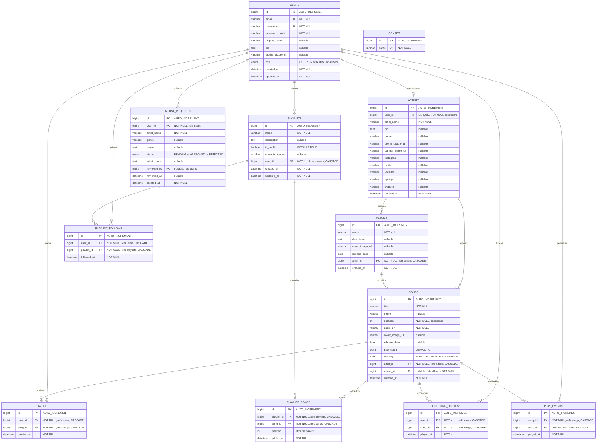
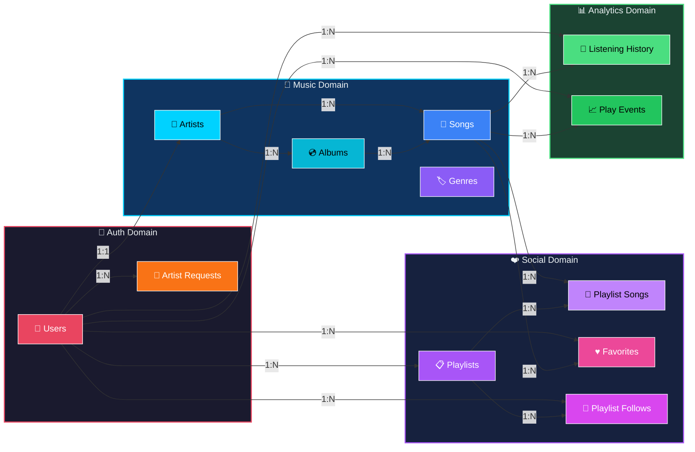
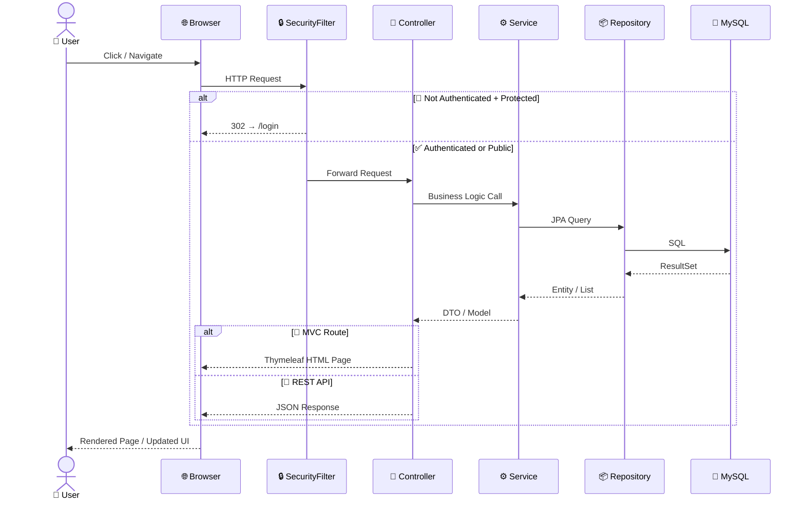
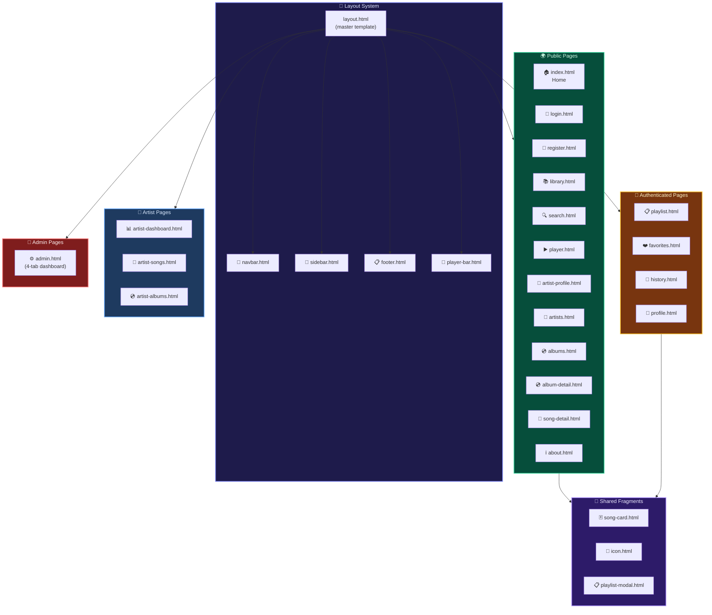
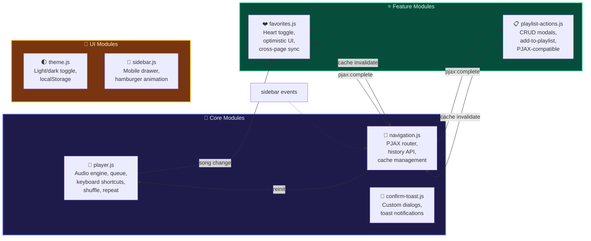
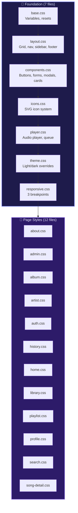
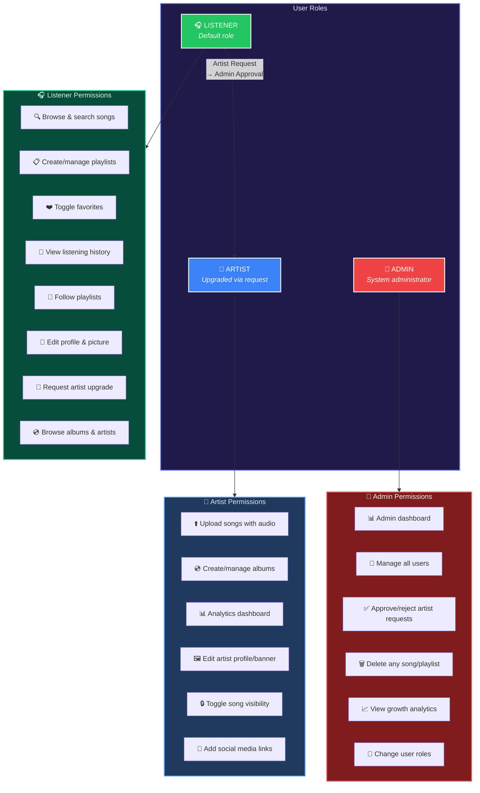
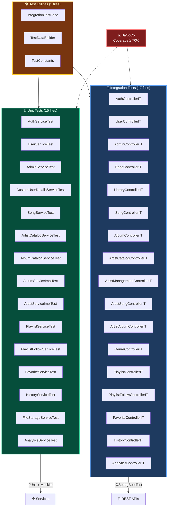

# 🎵 RevPlay — Architecture & ERD Documentation

> Complete technical architecture of the RevPlay music streaming platform

---

## 1. 🗃️ Entity Relationship Diagram (ERD)

### 1.1 Full Database Schema

### 1.2 Relationships Summary

### 1.3 Database Indexes

| Table | Index | Column(s) | Purpose |
|:------|:------|:----------|:--------|
| `users` | `idx_users_email` | `email` | Login lookup |
| `users` | `idx_users_username` | `username` | Login lookup |
| `users` | `idx_users_role` | `role` | Admin role filtering |
| `artists` | `idx_artists_artist_name` | `artist_name` | Search by name |
| `albums` | `idx_albums_artist_id` | `artist_id` | FK join optimization |
| `albums` | `idx_albums_release_date` | `release_date` | Sort by date |
| `songs` | `idx_songs_artist_id` | `artist_id` | FK join optimization |
| `songs` | `idx_songs_album_id` | `album_id` | FK join optimization |
| `songs` | `idx_songs_title` | `title` | Search by title |
| `songs` | `idx_songs_genre` | `genre` | Filter by genre |
| `songs` | `idx_songs_visibility` | `visibility` | Filter public/private |
| `songs` | `idx_songs_play_count` | `play_count DESC` | Trending sort |
| `songs` | `idx_songs_release_date` | `release_date` | Sort by date |
| `playlists` | `idx_playlists_user_id` | `user_id` | My playlists lookup |
| `playlists` | `idx_playlists_is_public` | `is_public` | Browse public playlists |
| `playlist_songs` | `idx_ps_playlist_id` | `playlist_id` | Playlist contents |
| `playlist_songs` | `idx_ps_song_id` | `song_id` | Song usage lookup |
| `favorites` | `idx_fav_user_id` | `user_id` | My favorites |
| `favorites` | `idx_fav_song_id` | `song_id` | Song popularity |
| `listening_history` | `idx_lh_user_id` | `user_id` | User history |
| `listening_history` | `idx_lh_played_at` | `played_at DESC` | Recent history |
| `play_events` | `idx_pe_song_id` | `song_id` | Analytics queries |
| `play_events` | `idx_pe_played_at` | `played_at DESC` | Trend analysis |

### 1.4 Unique Constraints

| Table | Constraint | Column(s) |
|:------|:----------|:----------|
| `users` | `uq_users_email` | `email` |
| `users` | `uq_users_username` | `username` |
| `genres` | `uq_genres_name` | `name` |
| `artists` | `uq_artists_user_id` | `user_id` |
| `playlist_songs` | `uq_playlist_songs` | `(playlist_id, song_id)` |
| `favorites` | `uq_favorites` | `(user_id, song_id)` |
| `playlist_follows` | `uq_playlist_follows` | `(user_id, playlist_id)` |

---

## 2. 🏗️ Application Architecture

### 2.1 Layered Architecture

```mermaid
graph TB
    subgraph Client["🖥️ Client Browser"]
        direction LR
        HTML["📄 Thymeleaf Pages<br/>21 pages"]
        FRAG["🧩 Fragments<br/>7 reusable"]
        CSS["🎨 CSS Modules<br/>19 files"]
        JSM["⚡ JavaScript<br/>7 modules"]
        AUD["🔊 HTML5 Audio"]
    end

    subgraph Security["🔒 Spring Security Layer"]
        direction LR
        SCONF["SecurityConfig<br/>URL protection + BCrypt"]
        UDS["CustomUserDetailsService<br/>DB auth provider"]
        AEP["AuthenticationEntryPoint<br/>Login redirect"]
        ADH["AccessDeniedHandler<br/>403 handling"]
    end

    subgraph Controllers["🌐 Controller Layer (17 controllers)"]
        direction TB
        subgraph MVC["📄 MVC Controllers (5)"]
            AC["AuthController"]
            PC["PageController"]
            UC["UserController"]
            ADC["AdminController"]
            LC["LibraryController"]
        end
        subgraph REST["📡 REST API Controllers (12)"]
            SC["SongController"]
            ALC["AlbumController"]
            ACC["ArtistCatalogController"]
            GC["GenreController"]
            PLC["PlaylistController"]
            PLFC["PlaylistFollowController"]
            FC["FavoriteController"]
            HC["HistoryController"]
            AMC["ArtistMgmtController"]
            ASC["ArtistSongController"]
            AALC["ArtistAlbumController"]
            ANC["AnalyticsController"]
        end
    end

    subgraph Services["⚙️ Service Layer (17 services)"]
        direction LR
        AS["AuthService"]
        US["UserService"]
        ADS["AdminService"]
        SS["SongService"]
        ALCS["AlbumCatalogService"]
        ARCS["ArtistCatalogService"]
        PS["PlaylistService"]
        PLFS["PlaylistFollowService"]
        FS["FavoriteService"]
        HS["HistoryService"]
        ASI["ArtistServiceImpl"]
        ALSI["AlbumServiceImpl"]
        ANS["AnalyticsService"]
        FSS["FileStorageService"]
    end

    subgraph Data["📦 Data Access Layer"]
        direction LR
        REPO["JPA Repositories<br/>12 repositories"]
        SPEC["SongSpecification<br/>Dynamic filtering"]
        MAP["SongMapper<br/>Entity ↔ DTO"]
        ENT["JPA Entities<br/>12 entities + 2 enums"]
    end

    subgraph CrossCut["🔧 Cross-Cutting Concerns"]
        direction LR
        GEH["GlobalExceptionHandler<br/>@ControllerAdvice"]
        GMA["GlobalModelAdvice<br/>Navbar data injection"]
        SU["SecurityUtils<br/>Current user helper"]
    end

    subgraph Storage["💾 Persistence"]
        direction LR
        DB[("🐬 MySQL 8<br/>revplay_db<br/>12 tables")]
        FW["🔄 Flyway<br/>5 migrations"]
        FS2[("📁 Filesystem<br/>/uploads/<br/>audio + images")]
    end

    Client -->|"HTTP / PJAX / AJAX"| Security
    Security --> Controllers
    Controllers --> Services
    Services --> Data
    Data --> Storage

    style Client fill:#1e1b4b,stroke:#818cf8,color:#e0e7ff,stroke-width:2px
    style Security fill:#7f1d1d,stroke:#f87171,color:#fef2f2,stroke-width:2px
    style Controllers fill:#1e3a5f,stroke:#60a5fa,color:#dbeafe,stroke-width:2px
    style MVC fill:#1e3a5f,stroke:#93c5fd,color:#dbeafe,stroke-width:1px
    style REST fill:#1e3a5f,stroke:#93c5fd,color:#dbeafe,stroke-width:1px
    style Services fill:#2d1b69,stroke:#a78bfa,color:#ede9fe,stroke-width:2px
    style Data fill:#064e3b,stroke:#34d399,color:#d1fae5,stroke-width:2px
    style CrossCut fill:#78350f,stroke:#fbbf24,color:#fef3c7,stroke-width:2px
    style Storage fill:#3b0764,stroke:#c084fc,color:#f5f3ff,stroke-width:2px
```

### 2.2 Request Flow

---

## 3. 🎨 Frontend Architecture

### 3.1 Page & Component Map

### 3.2 JavaScript Module Architecture

### 3.3 CSS Architecture

---

## 4. 🔐 Role-Based Access Control

---

## 5. 🧪 Testing Architecture

---

## 6. 📊 File Statistics

| Category | Count | Details |
|:---------|:-----:|:--------|
| 🗃️ Models | 14 | 12 entities + 2 enums |
| 🌐 Controllers | 17 | 5 MVC + 12 REST |
| ⚙️ Services | 17 | Business logic layer |
| 📦 DTOs | 17 | Request/response objects |
| 📚 Repositories | 12 | Spring Data JPA |
| 📄 Templates | 21 | Thymeleaf pages |
| 🧩 Fragments | 7 | Reusable components |
| 🎨 CSS | 19 | 7 foundation + 12 page-specific |
| ⚡ JS | 7 | Player, navigation, favorites, etc. |
| 🧪 Tests | 35 | 15 unit + 17 integration + 3 utilities |
| 🔧 Config | 3 | Security, Web, ModelAdvice |
| ⚠️ Exceptions | 8 | Custom exceptions + handlers |
| 🔄 Migrations | 5 | Flyway SQL files |
| 🧰 Other | 3 | Mapper, Specification, SecurityUtils |
| **TOTAL** | **~155** | Java + HTML + CSS + JS + SQL |
